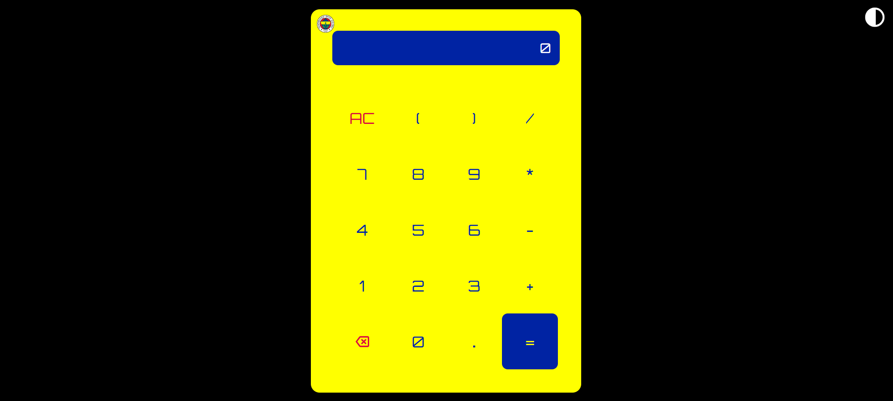
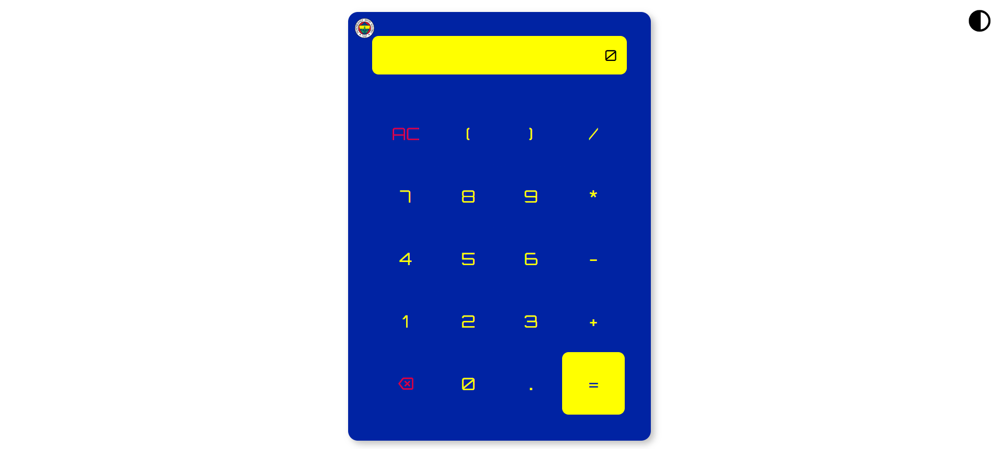

# 🟡🔵 Fenerbahçe Themed Calculator

A modern and aesthetic web-based calculator application customized with Fenerbahçe colors.

## Features

- **Fenerbahçe Colors**: Yellow-navy blue color theme
- **Dark/Light Mode**: User-friendly theme switching
- **Logo Animation**: Impressive glow effect when clicking the Fenerbahçe logo
- **Modern Design**: Sleek and user-friendly interface
- **Responsive Design**: Adaptable to all screen sizes
- **Keyboard Support**: Full keyboard support for quick usage

## Keyboard Shortcuts

- `Enter`: Performs calculation (=)
- `Escape`: Clears the display (AC)
- `Backspace`: Deletes the last character
- Numbers and operators can be entered directly from keyboard

## Design Features

- Modern appearance with Orbitron font
- Button hover effects
- Smooth transition animations
- Full-screen view support

## Screenshots

## Technologies

- HTML5
- CSS3
- JavaScript (Vanilla)
- Google Fonts (Orbitron)

## Usage

1. Open the calculator
2. Enter numbers and operators (using mouse or keyboard)
3. Press `=` or `Enter` to see the result
4. Press `AC` or `Escape` to clear the display
5. Click the theme icon in the top right corner to switch themes
6. Click the Fenerbahçe logo in the top left corner to see the animation

## Special Features

- Design reflecting Fenerbahçe spirit with yellow-navy blue color theme
- Special 5-second glow animation on logo click
- Color harmony in dark/light mode transitions
- Precise calculation results

---
*This project is specially designed for Fenerbahçe supporters. 💛💙*